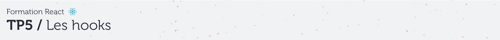
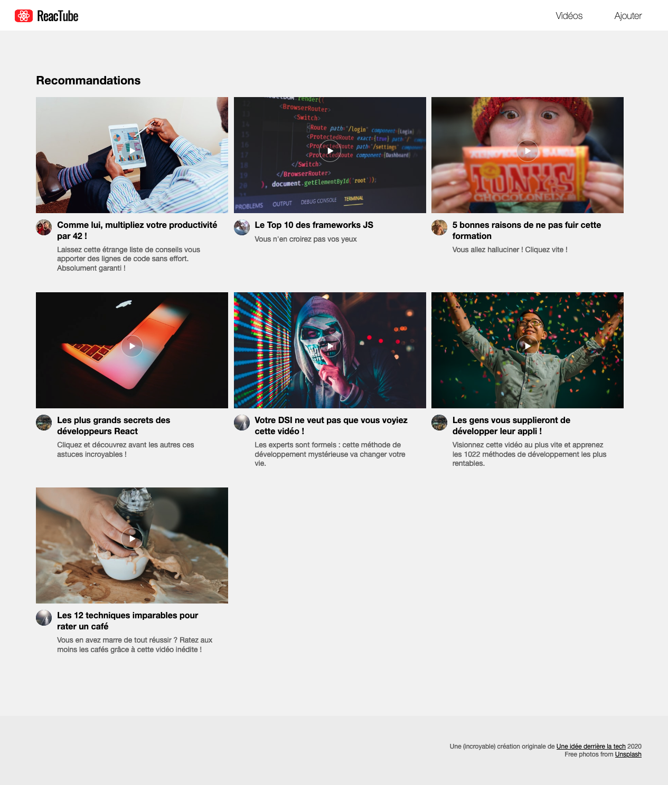

# A. Préparatifs <!-- omit in toc -->

Vous commencez maintenant à avoir l'habitude, je ne rentrerais donc pas dans les détails mais voici les différentes étapes pour le lancement du projet en mode [TL;DR](https://en.wiktionary.org/wiki/tl;dr)

> _**NB :** Si vous repartez de vos fichiers, **pensez à faire un `git pull`** pour récupérer les dernières modifications du repo (probablement des modifs de CSS ou des corrections de dernière minute)._

1. **Tapez dans un terminal :**
	```bash
	mkdir ~/tps-react
	git clone https://framagit.org/formation/react/tp5.git ~/tps-react/tp5
	codium ~/tps-react/tp5
	```
2. **Puis dans 2 terminaux splittés de VSCodium :**
	```bash
	npm i
	npm start
	```
	et :
	```bash
	cd ~/tps-react/api-server
	npm start
	```

> _**NB :** si vous souhaitez plus de précisions sur les commandes précédentes et l'installation  / configuration du projet, vous pouvez vous référer au chapitre [A. Préparatifs](https://framagit.org/formation/react/tp2/-/blob/master/A-preparatifs.md) du TP2 ou simplement demander de l'aide au formateur_ 😄

Le résultat attendu est le suivant :



## Étape suivante <!-- omit in toc -->
Si tout fonctionne, vous pouvez passer à l'étape suivante : [B. Les hooks de base](B-hooks.md)